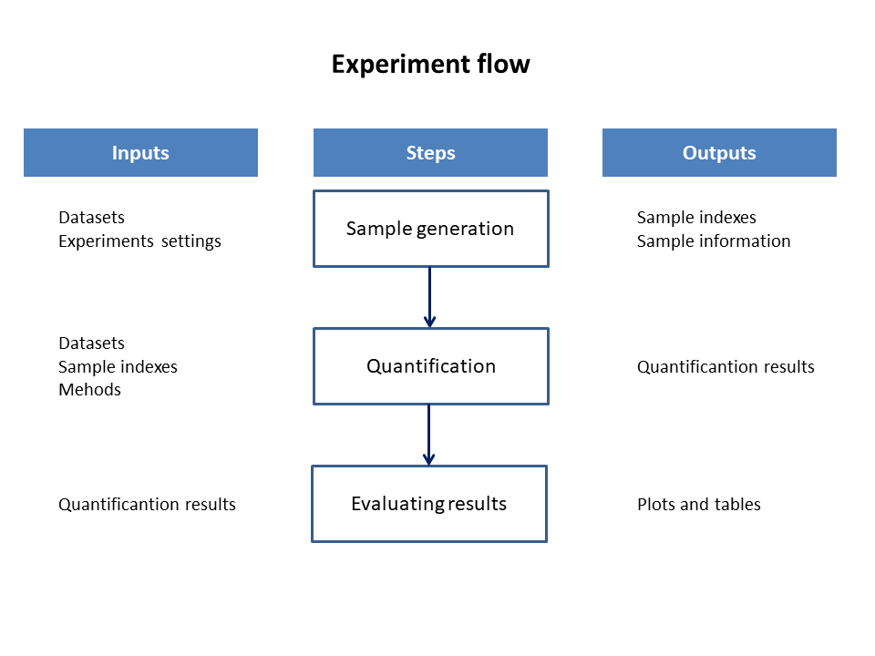

# ratio_estimator
This repository contains the codes used in the experiments related to paper named “Quantification under prior probability shift: the ratio
estimator and its extensions” (https://arxiv.org/abs/1807.03929) by Afonso Fernandes Vaz, Rafael Izbicki and Rafael Bassi Stern. We performed three experiments, aiming at:

1. Comparing different quantification methods under prior shift scenario;
2. Evaluating perfomance of our goodness-of-fit test;
3. Comparing the ratio regression estimator against the classify and count approach.

We organize each experiment in their own folder of the repository as discussed bellow.

###  Ratio estimator (ratio)
Systematically, the experiment 
can be seen as a process where each step has its own goal, inputs and outputs. This process is represented by the following flow. 

There are two
